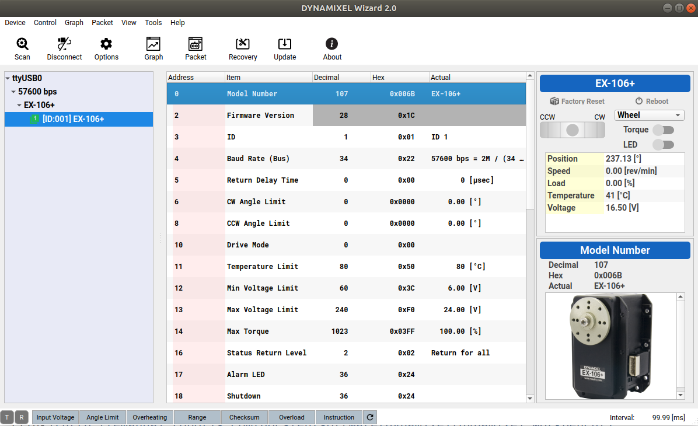

## Install Dynamixel Wizard
[link](http://emanual.robotis.com/docs/en/software/dynamixel/dynamixel_wizard2/)
This package helps test the connection of the servo motor assuming that a proper physical connection has been established. 
It also helps manage the driver versions. 
```
ls /dev/tty*
```
to see if a USB connection has been established. Then open Dynamixel Wizard, click on options to shorten the scan, and finally do scan. If a motor connection is found, it would look like this. 

## Installation of Dynamixel Workbench with ROS on Ubuntu
[link](http://emanual.robotis.com/docs/en/software/dynamixel/dynamixel_workbench/)


## Dynamixel SDK tutorial
[link](http://emanual.robotis.com/docs/en/software/dynamixel/dynamixel_sdk/sample_code/python_read_write_protocol_2_0/)
